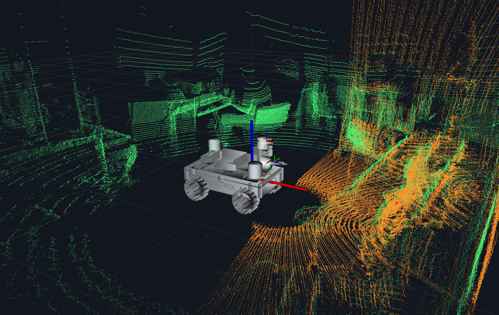
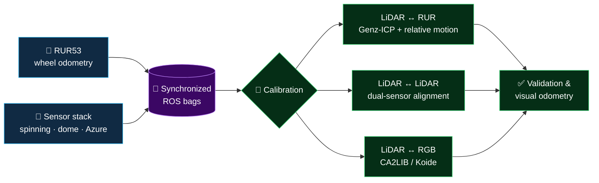

# AutoSweep

## RUR53 Data Acquisition at Eureka Test Site

> **Capture. Calibrate. Validate.** AutoSweep brings the RUR53 robot, dual
> Ouster LiDARs, and Azure Kinect into one ROS workflow for repeatable mobile
> sensor experiments.

The repository is organized around three steps: launch and record the sensor
stack, estimate the sensor-to-robot and LiDAR-to-camera transforms, then check
the results on independent data before using them for odometry or mapping.

### Launch RUR 
    - noetic
    - devel
    - rur_ssh (password: R0b0tn1K)

### Launch sensors stack
    - noetic
    - devel
    - activate_rur
    - ./autosweep/sensors_drivers_RUR/sensors_drivers_stack.py

### Extrinsic Calibration

### Lidar2Lidar 
    - noetic
    - devel
    - activate_rur
    - ./autosweep/extrinsic_calib_RUR/lidar2lidar/lidar2lidar_icp_calibration.py 

### Lidar2RUR
    - noetic
    - devel
    - activate_rur
    - ./autosweep/sensors_drivers_RUR/sensors_drivers_stack.py --fps_camera 5 --fps_lidar 5 --lidar_res 4096

### Lidar2RGB (CA2LIB)

Collect measurements:
- rosrun ca2lib calibrate_lidar_camera \
    -c /rgb/image_raw \
    -i autosweep/extrinsic_calib_RUR/lidar2rgb/config/cam_intrinsics.yaml \
    -l /ouster/points \
    -t autosweep/extrinsic_calib_RUR/lidar2rgb/config/chessboard_target.yaml  \
    --output-planes autosweep/extrinsic_calib_RUR/lidar2rgb/measures/measures4.txt \
    -a

Perform offline optimization:
- rosrun ca2lib calibrate_lidar_camera_offline \
    --input autosweep/extrinsic_calib_RUR/lidar2rgb/measures/measures2.txt \
    --output autosweep/extrinsic_calib_RUR/lidar2rgb/lidar_in_cam_T/lidar_in_cam2.yaml \
    --iterations <num_iter> \
    --threshold-inlier <inlier_th> \
    --huber <huber_th> \
    --damping <damping_factor>

### Validation
    - python3 autosweep/extrinsic_calib_RUR/backprojective_validation.py \
        --mode ca2lib \
        --folder outdoorJun24 \
        --yaml autosweep/extrinsic_calib_RUR/lidar2rgb/lidar_in_cam_T/lidar_in_cam_3_tuned.yaml

### Visual Odometry Tests
    - noetic
    - devel
    - activate_rur
    - ./autosweep/visual_odometry_RUR/visual_odometry_acquisition_stack.py

### RUR STUFF ###
alias activate_rur="export ROS_MASTER_URI=http://192.168.53.2:11311/ && export ROS_IP=192.168.53.15"
alias rur_ssh="ssh summit@192.168.53.2"
alias rur_setup="$pp=$(pwd) & cd ~/Documents/wheelchair/ & source devel/setup.bash & sh src/rur_setup/scripts/rur_setup.sh & cd $pp"
